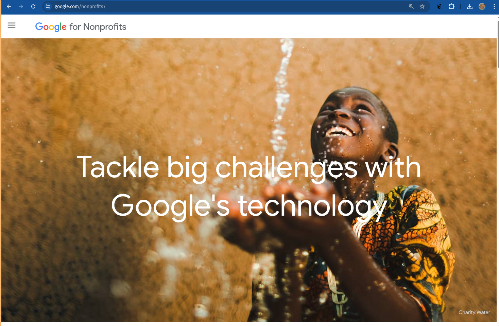
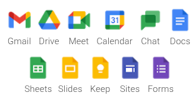
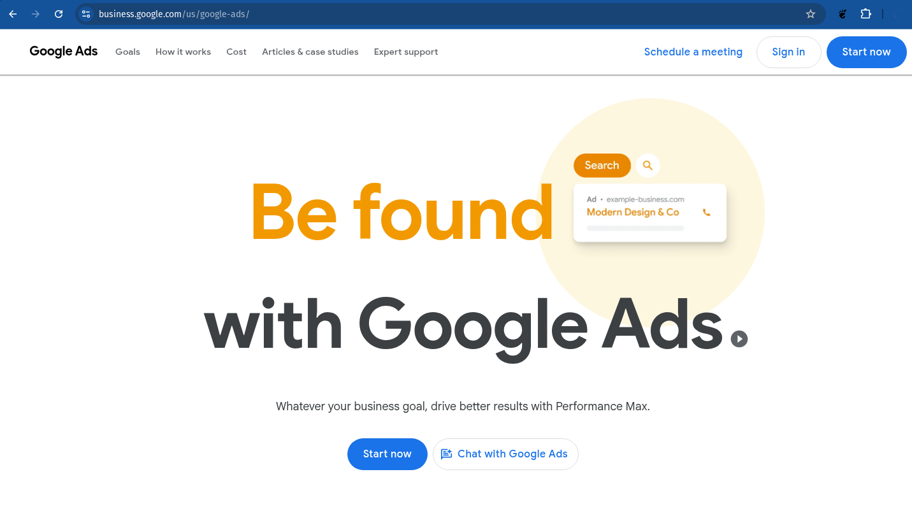
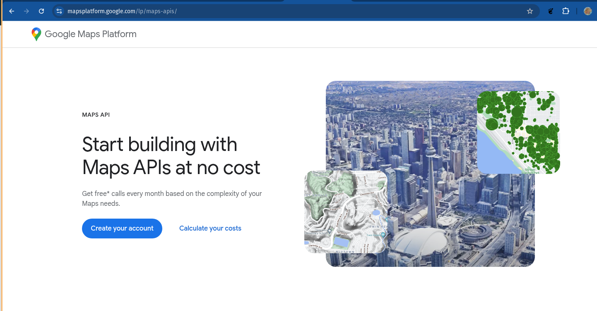
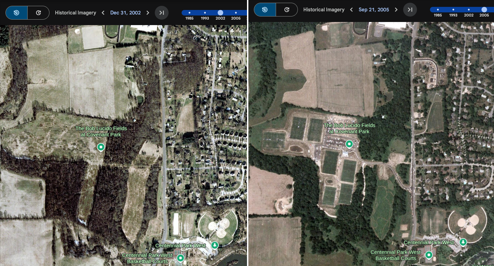
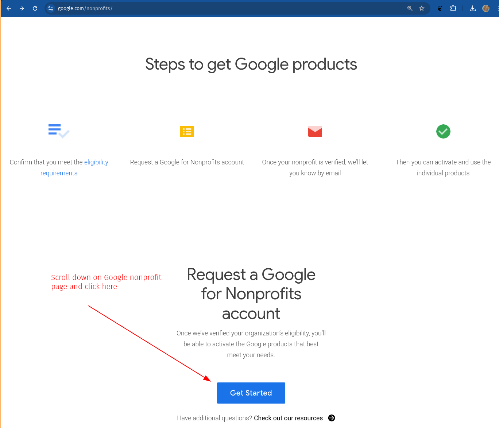
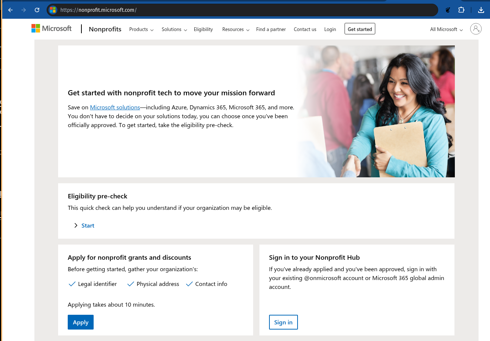
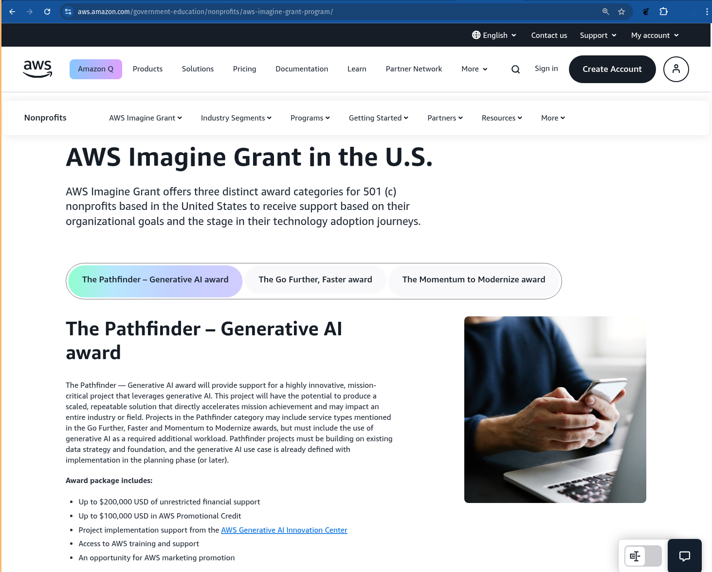
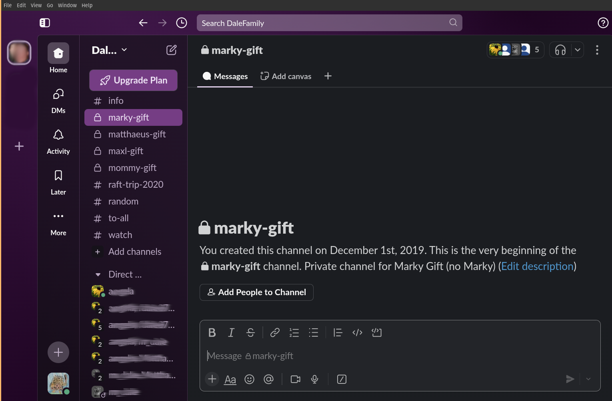
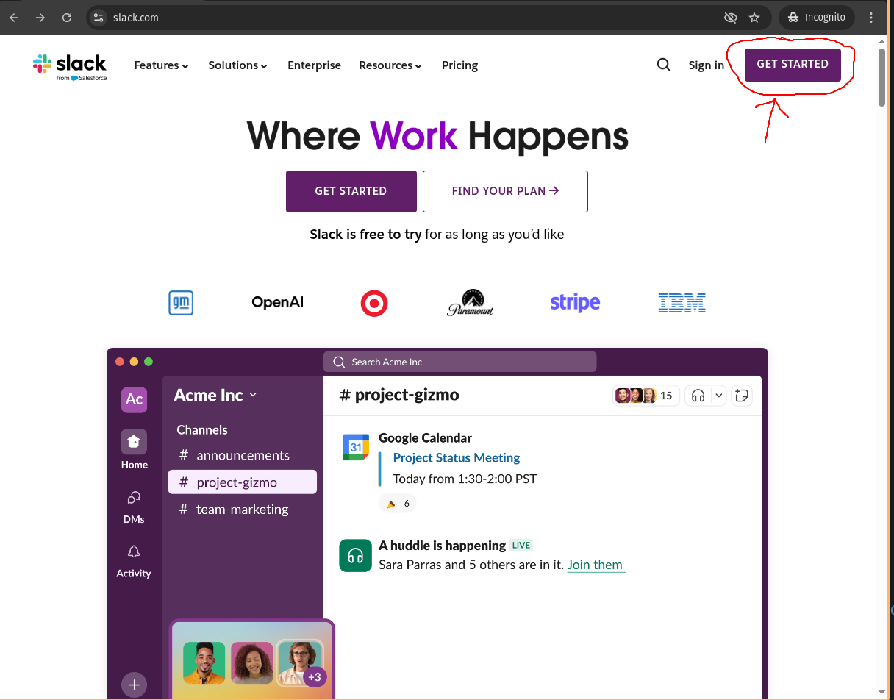

---
header-includes:
 - \usepackage{fvextra}
 - \DefineVerbatimEnvironment{Highlighting}{Verbatim}{breaklines,commandchars=\\\{\}}
title: "IT Resources for Nonprofits"
author: Markus Dale, medale@gmail.com
date: May 2025
---

# Ora Lee Volunteer IT work
:::::::::::::: {.columns}
::: {.column width="70%" align=top}
* Google Workspace admin
     * Email/groups, Google Meet
     * Shared documents
     * Internal web pages/Who's who?
* Amazon Web Services (AWS)
     * Wordpress on virtual machine
* Microsoft Office
* Salesforce CRM
* Mobile Cause Admin (now Ora Lee uses zeffy.com)
:::
::: {.column width="30%" align=top}

:::
::::::::::::::

# Are you currently...?

# Google For Nonprofits
:::::::::::::: {.columns}
::: {.column width="70%" align=top}
* https://www.google.com/nonprofits/
* Google Workspace
* Google Ad Grants
* YouTube Nonprofit
* Google Earth and Google Maps
:::
::: {.column width="30%" align=top}

:::
::::::::::::::

# Google Workspace
:::::::::::::: {.columns}
::: {.column width="70%" align=top}
* https://www.google.com/nonprofits/
* Google Workspace 
     * Institutional Gmail (@your-domain), Calendar
     * Google Meet - up to 150 participants
     * Google Drive - 100TB of shared storage
     * Docs/Sheets/Slides
     * Keep
     * Sites/Forms
:::
::: {.column width="30%" align=top}

:::
::::::::::::::

# Google Ads Grants
:::::::::::::: {.columns}
::: {.column width="70%" align=top}
* Up to $10,000/month credit
* Drive traffic to your website
* Google Analytics - analyze web site traffic
:::
::: {.column width="30%" align=top}

:::
::::::::::::::

# Google Maps
{width=95%, height=95%}

# Google Earth
{width=95%, height=95%}

# Google for Nonprofits Sign Up

# Microsoft
* [https://nonprofit.microsoft.com/](https://nonprofit.microsoft.com/)
* Microsoft 365 for nonprofits
* Azure $2000 grant - cloud services ("rent someone else's computer")
* Dynamics 365 Business Central
* Advanced security - Microsoft AccountGuard for M365

# Microsoft for Nonprofits Sign Up

# Amazon Web Services (AWS)
:::::::::::::: {.columns}
::: {.column width="70%" align=top}
* AWS Imagine Grant
* AWS Nonprofit Credit Program (via TechSoup)
* https://www.techsoup.org/amazon-web-services
:::
::: {.column width="30%" align=top}

:::
::::::::::::::

# Techsoup

# Communications: Slack

# Slack Sign Up

