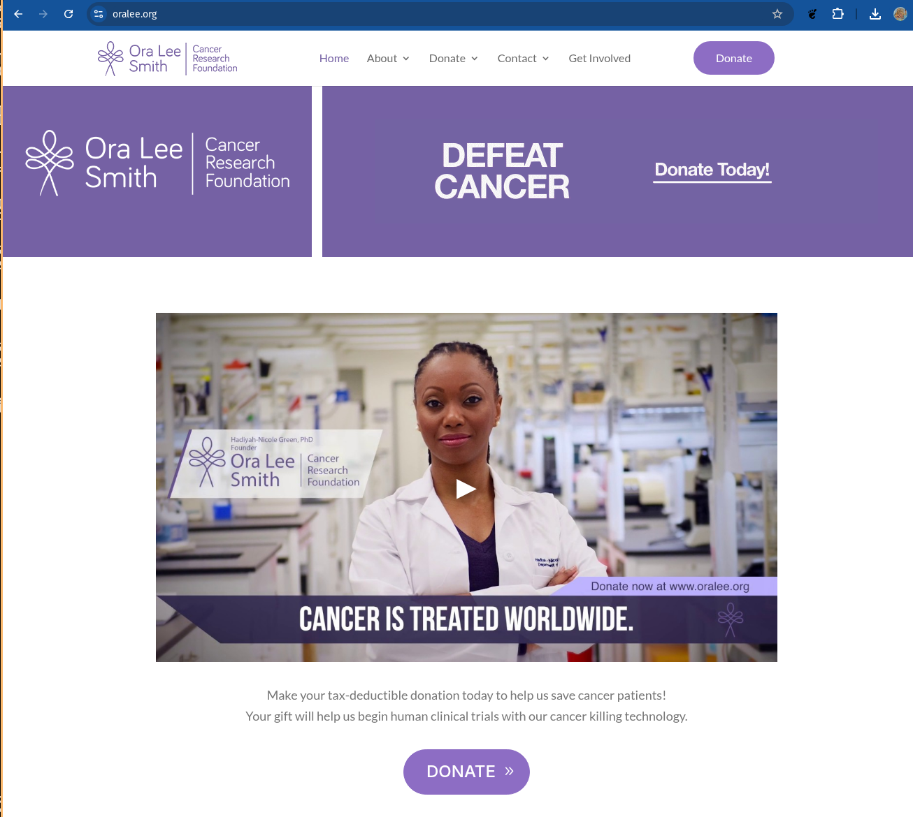
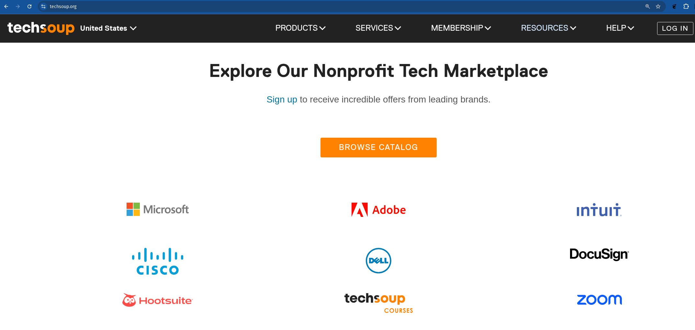

---
header-includes:
 - \usepackage{fvextra}
 - \DefineVerbatimEnvironment{Highlighting}{Verbatim}{breaklines,commandchars=\\\{\}}
title: "IT Resources for Nonprofits"
author: Markus Dale, medale@gmail.com
date: May 2025
---

# Introduction
{width=50%, height=95%}

# Volunteer IT work - Ora Lee Smith Cancer Research

# Ora Lee Volunteer IT work
* Google Workspace admin
     * Email/groups, Google Meet
     * Shared documents
     * Internal web pages/Who's who?
* Amazon Web Services (AWS)
     * Wordpress on virtual machine
* Microsoft Office
* Salesforce - customer/donor relationship management (CRM)
* Mobile Cause Admin (now Ora Lee uses zeffy.com)

# Google Workspace
* https://www.google.com/nonprofits/
* Google Workspace
     * Institutional Gmail, Calendar, Google Meet, Google Drive

# Google Ad Grants
* Up to $10,000/month credit
* Drive traffic to your website
* Google Analytics - analyze web site traffic

# Microsoft
* [https://nonprofit.microsoft.com/en-us/getting-started](https://nonprofit.microsoft.com/en-us/getting-started)
* Microsoft 365 for nonprofits
* Azure $2000 grant
* Dynamics 365 Business Central (CRM - $28/registered nonprofit user)
* Advanced security - Microsoft AccountGuard for M365

# Techsoup

